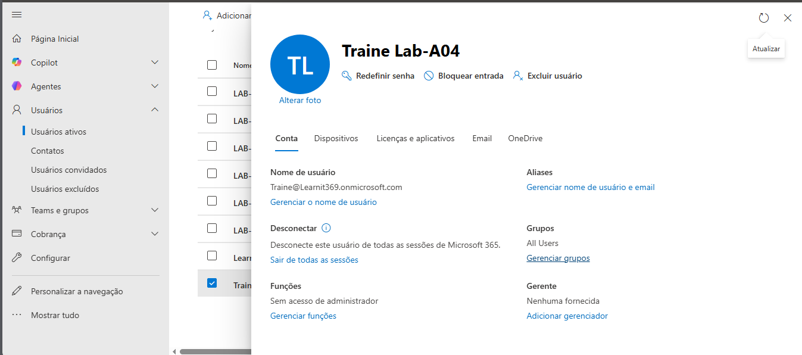

# Exercício 1 - Criar utilizador trainee-LAB-A04

## Objetivo
Criar um novo utilizador no Microsoft 365 Admin Center.

## Passos realizados
1. Acedi ao portal Microsoft 365 Admin Center.
2. Naveguei para Users > Active Users.
3. Cliquei em Add User.
4. Criei o utilizador trainee-LAB-A04.

## Resultado
O utilizador foi criado com sucesso e encontra-se ativo no tenant.

## Evidência

