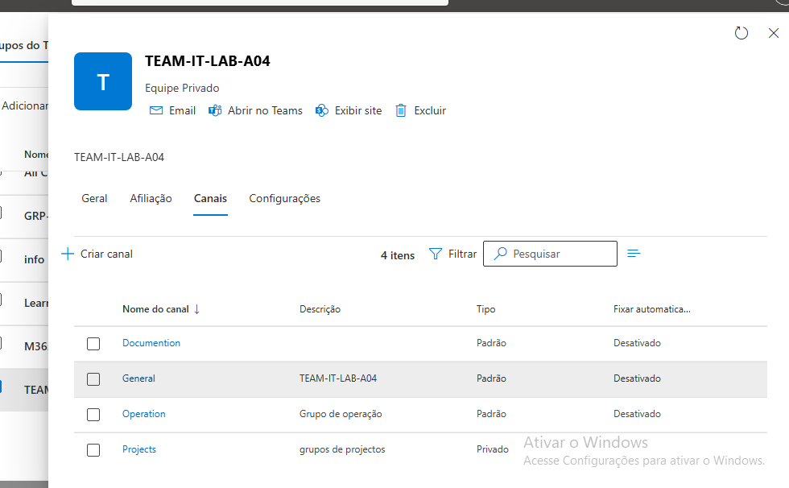

## 12 – Criação de Canais no Team

Foram criados três canais dentro da equipa TEAM-IT-LAB-A04.

Canais criados:

- Operations
- Projects
- Documentation

Passos realizados:

1. Abri a equipa TEAM-IT-LAB-A04 no Microsoft Teams.
2. Cliquei em "Adicionar canal".
3. Criei o canal Operations.
4. Repeti o processo para os canais Projects e Documentation.

Resultado:
A equipa agora possui canais organizados
para diferentes tipos de comunicação e colaboração.

