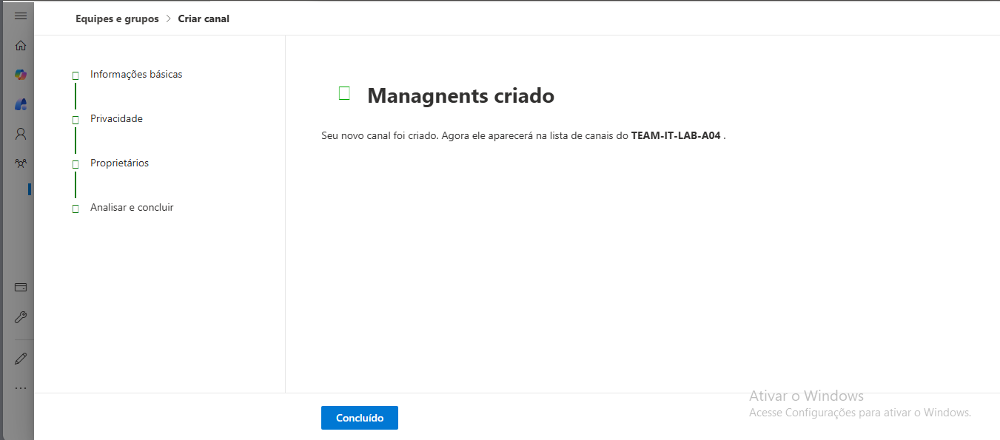

## 14 – Criação de Canal Privado

Neste exercício foi criado um canal privado chamado
Management dentro da equipa TEAM-IT-LAB-A04.

Passos realizados:

1. Acedi à equipa TEAM-IT-LAB-A04 no Microsoft Teams.
2. Cliquei na opção "Add Channel".
3. Defini o nome do canal como Management.
4. Configurei a privacidade como "Private".
5. Selecionei os membros autorizados a aceder ao canal.

Resultado:
Foi criado um canal privado que permite comunicação restrita
entre membros específicos da equipa.

