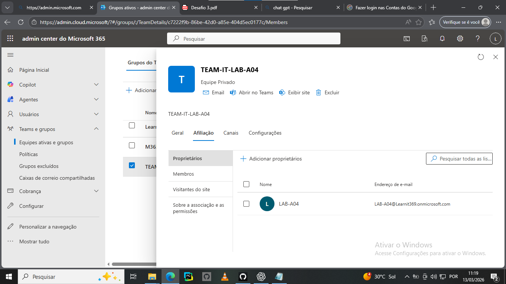

## 15 – Promoção de Membro para Owner

Neste exercício foi promovido um membro da equipa
para a função de Owner.

Passos realizados:

1. Acedi à equipa TEAM-IT-LAB-A04.
2. Cliquei em "Manage Team".
3. Naveguei até à secção "Members".
4. Localizei o utilizador pretendido.
5. Alterei a função de "Member" para "Owner".

Resultado:
O utilizador agora possui permissões administrativas
para gerir membros e configurações da equipa.

