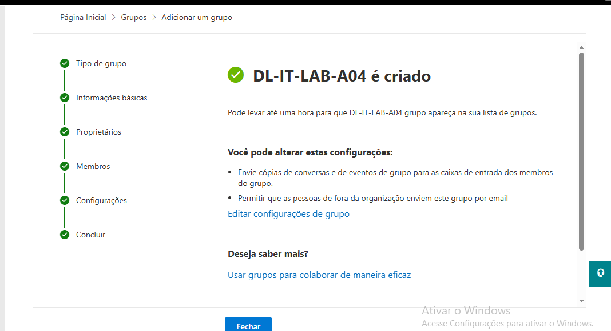

##  18 – Criação de Distribution List

Foi criada uma lista de distribuição chamada DL-IT-LAB-A04.

Passos realizados:

1. Acedi ao Exchange Admin Center.
2. Naveguei até à secção Recipients.
3. Cliquei em Groups.
4. Selecionei Distribution List.
5. Criei a lista DL-IT-LAB-A04.

Resultado:
A lista permite enviar emails para vários utilizadores
através de um único endereço.

