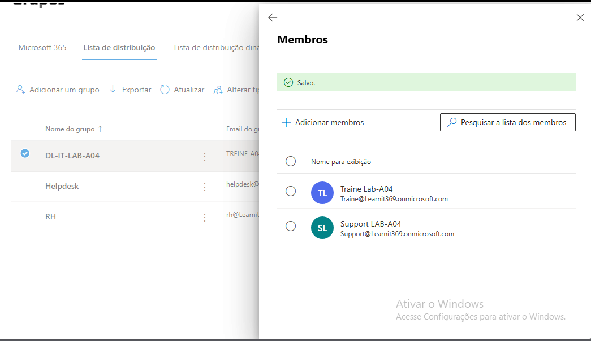

## 19 – Adição de Membros à Distribution List

Neste exercício foram adicionados membros
à lista de distribuição DL-IT-LAB-A04.

Passos realizados:

1. Acedi ao Exchange Admin Center.
2. Naveguei até Groups.
3. Abri a lista DL-IT-LAB-A04.
4. Acedi à secção Members.
5. Adicionei os utilizadores trainee-LAB-A04 e support-LAB-A04.

Resultado:
Os membros agora recebem emails enviados
para a lista de distribuição.

