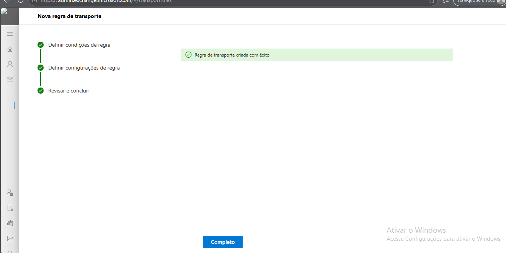

## 20 – Regra de Fluxo de Email

Foi criada uma regra de fluxo de email chamada
Disclaimer-LAB-A04 no Exchange Online.

Passos realizados:

1. Acedi ao Exchange Admin Center.
2. Naveguei até à secção Mail Flow.
3. Cliquei em Rules.
4. Criei uma nova regra chamada Disclaimer-LAB-A04.
5. Configurei a ação de adicionar um disclaimer
nas mensagens enviadas pela organização.
6. Inserido o texto "Confidential Message LAB-A04".

Resultado:
Todos os emails enviados pela organização
passam a incluir automaticamente o aviso de confidencialidade.

