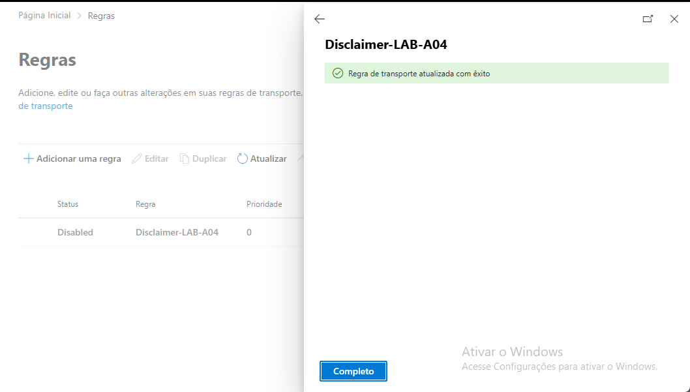

##  21 – Configuração de Disclaimer de Email

Neste exercício foi configurado um aviso automático
(disclaimer) no Exchange Online.
Isso é muito usado em empresas para:

confidencialidade:
avisos legais
compliance

Passos realizados:

1. Acedi ao Exchange Admin Center.
2. Naveguei até à secção Fluxo de Email.
3. Abri a regra Disclaimer-LAB-A04 criada anteriormente.
4. Configurei o texto "Confidential Message LAB-A04".
5. Guardei a regra.

Resultado:

Todos os emails enviados pela organização passam a incluir
automaticamente o aviso de confidencialidade definido.

