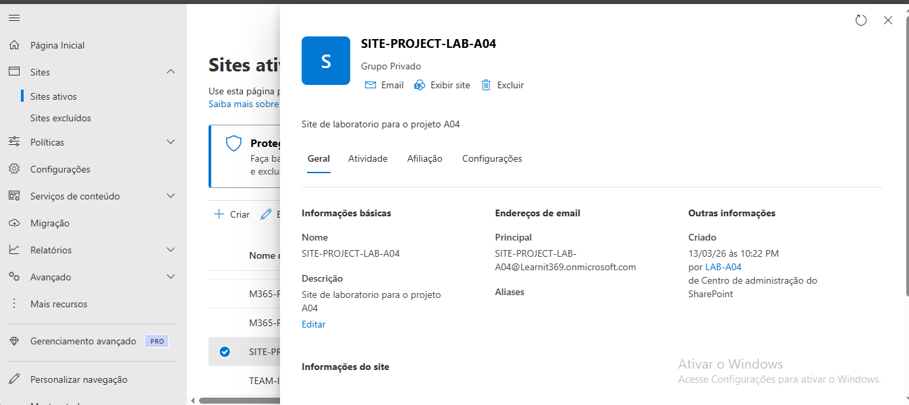

##  22 – Criação de Site SharePoint

Foi criado um site de colaboração no SharePoint
para gestão de projetos.

Passos realizados:

1. Acedi ao SharePoint Admin Center.
2. Naveguei até Sites Ativos.
3. Selecionei a opção Criar.
4. Escolhi Site de equipa.
5. Configurei o nome SITE-PROJECT-LAB-A04.
6. Defini trainee-LAB-A04 como proprietário.
7. Finalizei a criação.

Resultado:

O site foi criado com sucesso e encontra-se
disponível para colaboração e armazenamento
de documentos de projetos.

