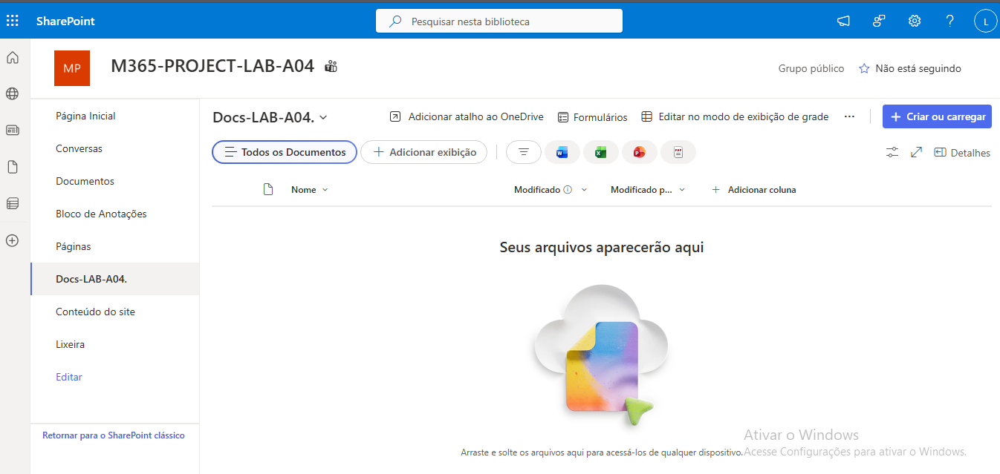

## 23 – Criação de Biblioteca de Documentos

Neste exercício foi criada uma biblioteca de documentos
no SharePoint para armazenamento estruturado de ficheiros.

Passos realizados:

1. Acedi ao site SITE-PROJECT-LAB-A04.
2. Cliquei em Novo.
3. Selecionei Biblioteca de documentos.
4. Configurei o nome Docs-LAB-A04.
5. Finalizei a criação.

Resultado:

A biblioteca Docs-LAB-A04 encontra-se disponível
para armazenamento de documentos.

