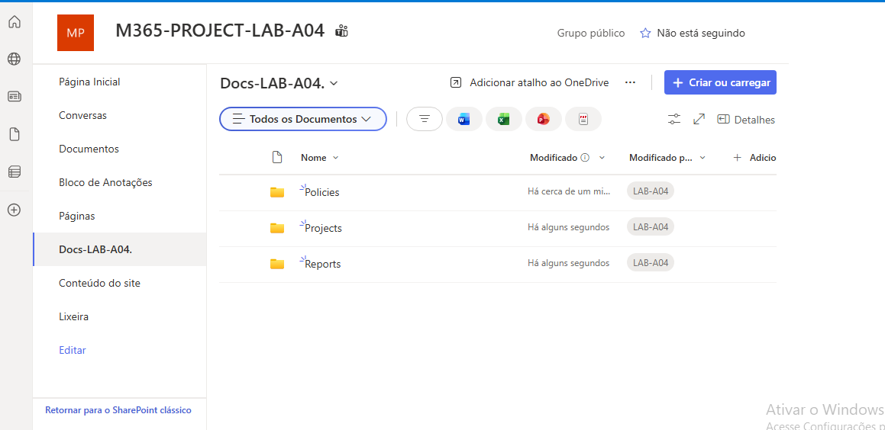

## 25 – Configuração de Permissões

Foi concedido acesso de edição ao grupo GRP-IT-LAB-A04
no site SharePoint.

Passos realizados:

1. Acedi às permissões do site.
2. Adicionei o grupo GRP-IT-LAB-A04.
3. Configurei o nível de permissão como Editar.

Resultado:

O grupo de IT pode agora colaborar
na gestão dos documentos.

