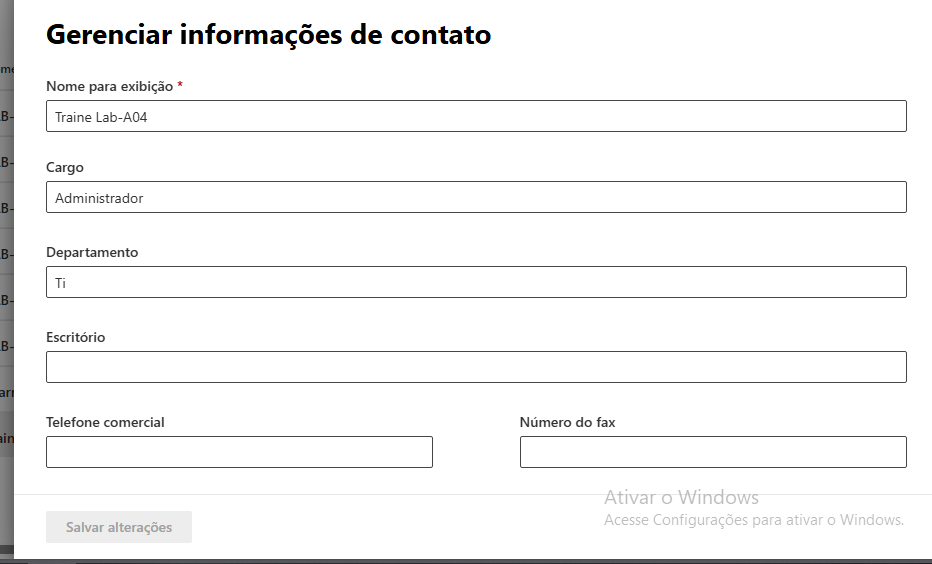

# Exercício 3 - Editar propriedades do utilizador

## Objetivo
Atualizar propriedades organizacionais do utilizador.

passo a passo:

Abrir utilizador

trainee-LAB-A04

 Ir em

Manage Contact Information

 Editar

Department: IT
Job Title: Administrator

 Guardar.
## Alterações realizadas
Department: IT
Job Title: Administrator

## Resultado
O utilizador foi atualizado com as informações organizacionais.

