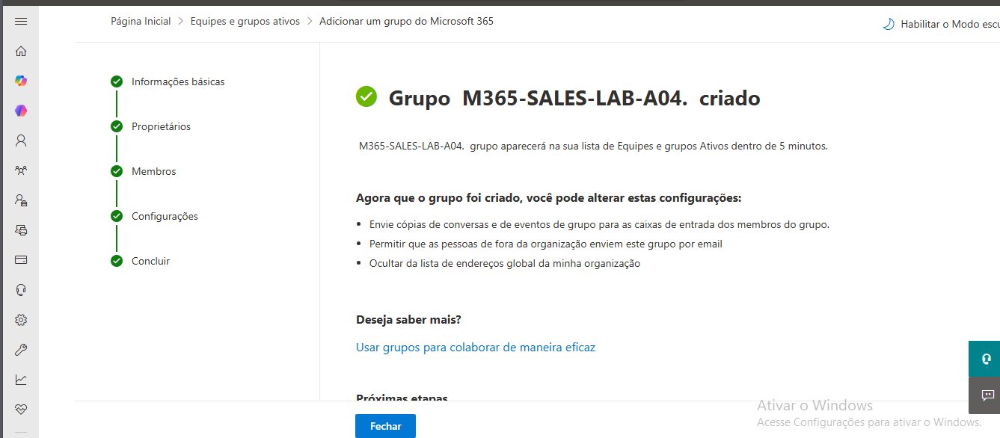

##  31 – Criação de Grupo Microsoft 365

Foi criado um grupo Microsoft 365 para a equipa de vendas.

Passos realizados:

1. Acedi ao Microsoft 365 Admin Center.
2. Naveguei até à secção Equipas e Grupos.
3. Selecionei Grupos ativos.
4. Cliquei em Adicionar grupo.
5. Escolhi o tipo Microsoft 365.
6. Configurei o nome M365-SALES-LAB-A04.
7. Defini trainee-LAB-A04 como proprietário.
8. Concluí a criação.

Resultado:

O grupo foi criado com sucesso e encontra-se
disponível para colaboração da equipa de vendas.

