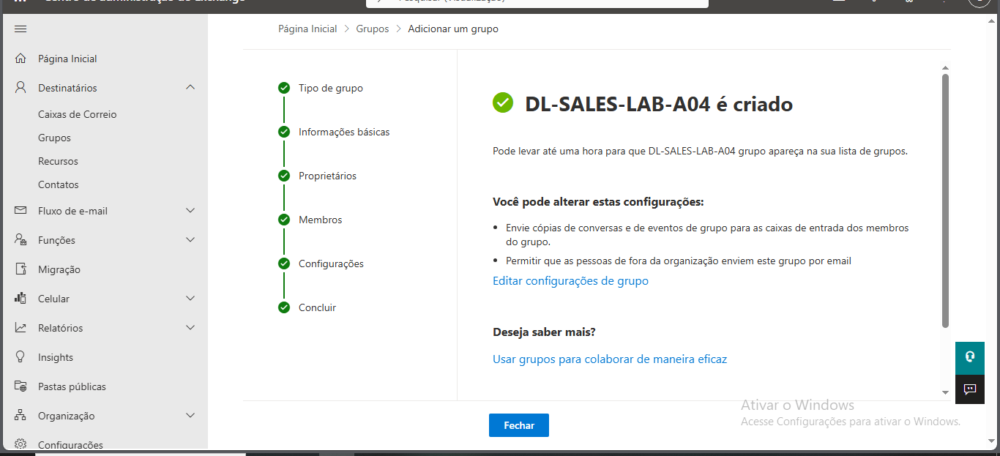

## Item 37 – Criação de Lista de Distribuição

Neste exercício foi criada uma lista de distribuição no Exchange Online
para permitir o envio de emails para vários utilizadores através de
um único endereço.

A lista de distribuição é frequentemente utilizada em ambientes
corporativos para facilitar a comunicação com equipas ou departamentos.

### Passos realizados

1. Acedi ao Exchange Admin Center.
2. Naveguei até à secção "Destinatários".
3. Selecionei a opção "Grupos".
4. Cliquei em "Adicionar grupo".
5. Escolhi o tipo "Lista de distribuição".
6. Configurei o nome da lista como DL-SALES-LAB-A04.
7. Defini o endereço de email correspondente.
8. Adicionei os membros trainee-LAB-A04 e support-LAB-A04.
9. Concluí a criação da lista.

### Resultado

A lista de distribuição DL-SALES-LAB-A04 foi criada com sucesso e
permite enviar emails para todos os membros do grupo através de
um único endereço de email.

